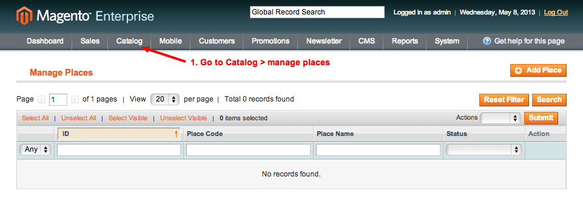
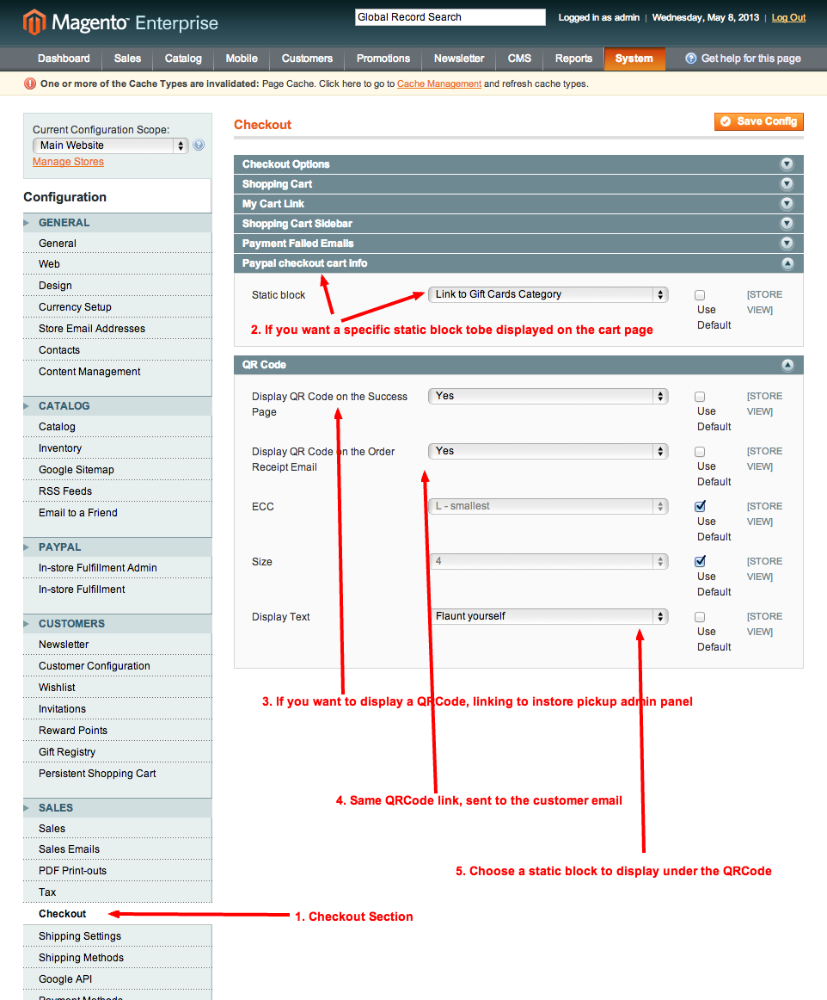

#PayPal Order Ahead with Magento
#Getting Started Guide, version 1.0
##Table of Contents

1. Overview
2. System Requirement
3. Prerequisites
4. Register an Application with Log in with PayPal
5. Configuring PayPal OrderAhead extension in Magento Admin Panel 
	5a. Changing the design package 
	5b. Configuring PayPal Checkin payment method 
	5c. Making sure the instore fulfillment shipping method is activated and configured 
6. Managing your retail stores, manage places
7. Enabling favorites functionality
8. Enabling QRCode functionality
9. Featured categories
10. Troubleshooting
 
##1. Overview

This setup guide is to enable PayPal Order Ahead to be used with Magento. PayPal Order Ahead will let consumers check in to stores and then directly pay for goods and services with their PayPal accounts. Merchant is able to set locations, create invoices, and take PayPal payments on the mobile devices.

##2. System Requirement

Your system must meet the following requirements:

* Magento Community 1.7 or Magento Enterprise 1.12 (If you are not sure what version you are running, log in to the Magento Admin Panel. The version displays at the bottom of the page).
* The latest version of this plugin on [magento connect](http://www.magentocommerce.com/magento-connect/catalog/product/view/id/17219/s/paypal-order-ahead-1245/) or simply clone this repository.

##3. Prerequisites

Before you register your application and enable the PayPal Check-in into the Magento, please make sure all of the following are true:

* You have a PayPal account (Premier or Merchant Account), which is needed to register your application with PayPal.
* The web server on which Magento runs uses Secure Sockets Layer (SSL), which is also referred to as Secure HTTP or HTTPS to retrieve all the user attributes that Log In with PayPal supports.
* Magento Admin should be on full valid HTTPS URL throughout.

##4. Register an Application with Log in with PayPal

1. Go to PayPal [devportal](https://devportal.x.com).

2. On the Developer Portal page, click Sign in to DevPortal or manage applications.3. 

3. Log in as PayPal Premier or Merchant Account when prompted.

4. On the Developer Portal page, click on Manage Applications to create new application.

5. Enter the following informations:

6. Register application

7. Click on the View Application button to review / modify the application information.

8. Note: PayPal Checkin is a new feature and access to it is currently controlled. To enable this feature for your merchant PayPal account, please file a ticket with PayPal Merchant Technical Support (MTS) as follows:

	* Go to: [http://www.paypal.com/mts](http://www.paypal.com/mts) and select Contact Technical Support.
	* Enter your information in the support ticket form.
	* In the subject field, enter: "Magento Orderahead plugin: activate PayPal Checkin API access"
	* In the Question field, enter:
		
		"Hi, 
		Is it possible to provide the PayPal checkin API access for my application: 
		YOUR APPLICATION ID GIVEN IN THE PREVIOUS STEPS 
		YOUR MERCHANT EMAIL ID" 
	* Estimated time for MTS to response would take 3-5 working days. You can login to check your application status.

##5. Configuring PayPal OrderAhead extension in Magento Admin Panel

After download and install the PayPal Order Ahead packages, please follow the steps as below: 

#### The best way to implement Orderahead is to actually create a new website/store/storeview to use the functionality. It will make you able to select the products you wanna your customers to pick up. It will also make sure the payment method and shipping method are only available on this order ahead website.

###5a. Changing the design package

Don't forget to use the website scope to modify all your parameters.

###5b. Configuring PayPal Checkin payment method

1. Enter the parameters you were given in the PayPal devportal and save the configuration.

2. Save your configuration and then go back to the same section and click on "Get new refresh token!".

###5c. Making sure the instore fulfillment shipping method is activated and configured

##6. Managing your retail stores, manage places

1. Go to Catalog > manage places

2. Add place and enter your physical store informations. 
tip: to easily find the longitude and latitude of your place, you can go to this [website](http://itouchmap.com/latlong.html). Don't mix up longitude and latitude!

3. First of all, make sure your magento cron is enabled on your server.  
Then, the Paypal App "local tab" is not available in all countries now, so it is possible that you don't see it in your android or iphone app. If you have access to it, and enabled PayPal Here API, your place should appear soon in PayPal app (if the place open, according to your place configuration).

##7. Enabling favorites functionality

##8. Enabling QRCode functionality

The QRCode functionaliy will create a QRCode for each order and show it to the customer on the order success page and will also be sent to his email.
The QRCode leads to your order fulfillment panel (only accessible with magento backend credentials) so thatthe merchant can actually see which items the customer wants to retrieve.
If you understand what ECC and size are, you can modify the default values, if not, you better not!

##9. Featured categories

The PayPal check-in package allows you to promote categories display them in your store home page.

###9a. Featuring a category

* Choose “Catalog > Categories > Manage Categories”.
* Select a category from the left hand side of the screen and set the “Featured” option to “Yes” under “General Information”.

The category should be displayed on your home.

###9b. Adding images to categories in order to display them in the home carousel

Simply add an image in te category configuration ad it will appear in the home carousel.

##10. Troubleshooting

###10a. 404 page on instorefulfillment config
It is an admin rights issue. Just log in and log out.